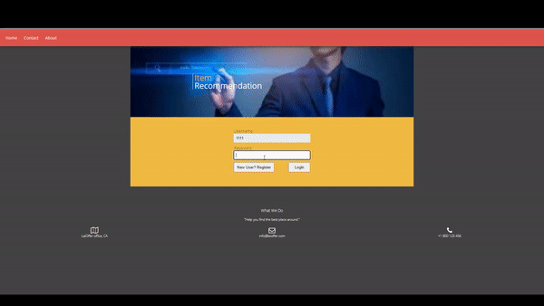

# jobRecommendation

• Developed an interactive web page for users to search and redirect them to the job application page (HTML, CSS, JavaScript, AJAX)

• Created three Java servlets with REST APIs to handle HTTP requests and responses.

• Used MySQL database on Amazon RDS to store position data fetched from GitHub Job API.

• Used MonkeyLearn API to extract keywords from the description. Designed an algorithm to implement content-based job recommendation.

• Deployed to Amazon EC2 for public accessibility.

